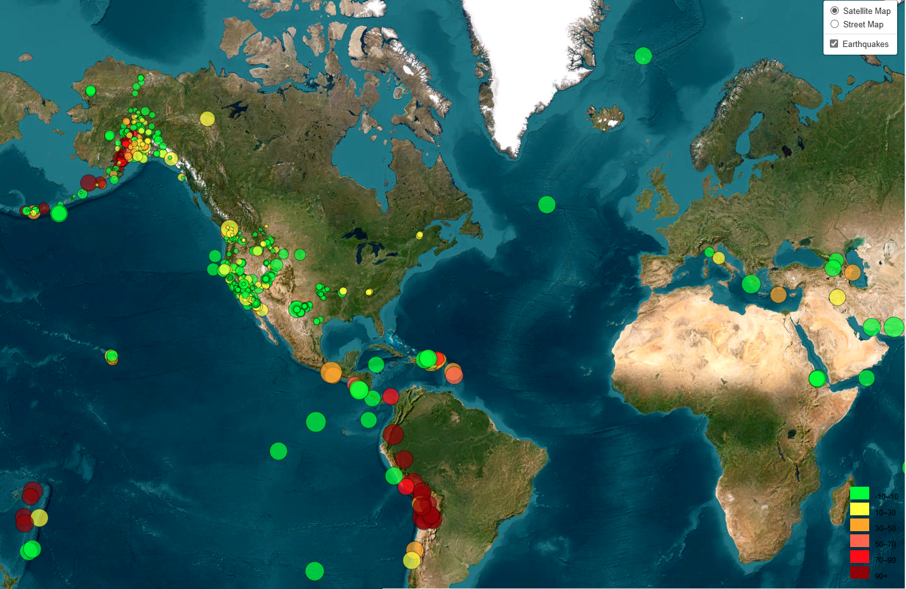

# Earthquake and Tectonic Plates Visualization

## Description

This project visualizes earthquake data and tectonic plate boundaries on an interactive map using [Leaflet.js](https://leafletjs.com/). 
This project has 2 parts.

## Part 1 - 
In this part, earthquake data is sourced from the USGS Earthquake Hazards Program. The map allows users to toggle between basemap and streetmap. Earthquake markers are colored by depth and sized by magnitude, with a legend to interpret the depth ranges.

## Screenshot

*Global view showing earthquake locations on the Satellite  and  Street basemaps.*

## Part 2 - 
In this part, in addition to earthquake data, tectonic plate boundaries are obtained from a public GeoJSON dataset. The map allows users to toggle between different basemaps (Satellite, Grayscale, Outdoors) and overlay layers (Earthquakes, Tectonic Plates). 

## Screenshot

*Global view showing earthquake locations and tectonic plate boundaries on the Satellite, Grayscale and Outdoor basemaps.*

## Key Features
- Interactive map with Leaflet.js
- Earthquake data from USGS (past week)
- Tectonic plate boundaries
- Multiple basemaps: Satellite, Grayscale, Outdoors, Street
- Earthquake markers colored by depth (green to red) and sized by magnitude
- Legend for depth ranges

## Usage

1. Right click on index.html and click on 'Preview in Default Browser' (if Open Browser Preview extension is already installed).
2. The map will load with the Satellite basemap by default, showing earthquake markers and tectonic plate boundaries (for Part 1 only earthquke markers and for Part 2 Earthquake markers and tectonic plates, both will be loaded).
3. Use the layer control (top-right corner) to:
   - `Switch between basemaps`: Satellite and Street (for Part1) and Satellite, Grayscale, Outdoors(for Part 2).
   - `Toggle overlays`: Earthquakes, Tectonic Plates for Part 2.
4. Click on an earthquake marker to see a popup with details (magnitude, location, depth).
5. Refer to the legend (bottom-right) to understand the depth color scale (green for shallow, red for deep).

## File Structure

- `index.html`: The main HTML file containing the map container and script links.
- `logic_part_1.js`: JavaScript file with the map logic, including Leaflet setup, data fetching for part 1.
- `logic_part_2.js`: JavaScript file with the map logic, including Leaflet setup, data fetching for part 2. 
- `style.css`: CSS file for styling the map and legend
- `images/`: Directory for storing screenshots.

## Technologies Used
- `Leaflet.js`: For interactive mapping.
- `D3.js`: For fetching and processing GeoJSON data.
- `HTML/CSS`: For structure and styling.
